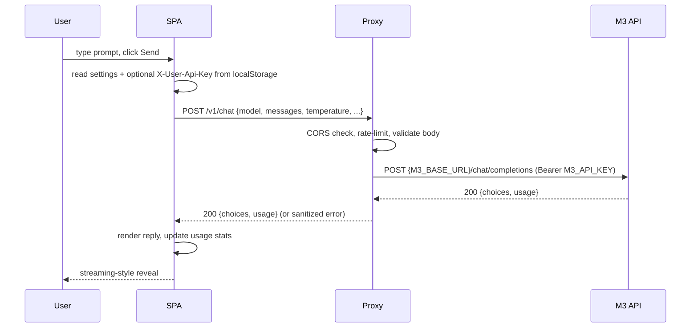

# Architecture

This document explains how the pieces of **M3 Secure Chat** fit together, the
threat model it defends against, and the contracts between them.

## High-level diagram

```
                            ┌──────────────────────────────┐
                            │          User's browser      │
                            │  React SPA (this repo)       │
                            │  - Chat / Settings / Sec.    │
                            │  - localStorage: settings    │
                            │  - base64-obfuscated user    │
                            │    key (optional)            │
                            └──────────────┬───────────────┘
                                           │  POST /v1/chat
                                           │  (X-User-Api-Key?: opt)
                                           │  Content-Type: application/json
                                           ▼
                            ┌──────────────────────────────┐
                            │  M3 Proxy (you deploy)       │
                            │  FastAPI + Uvicorn           │
                            │  - CORS check                │
                            │  - Rate limit (per IP)       │
                            │  - Holds M3_API_KEY          │
                            │  - Redacts upstream errors   │
                            │  - Pydantic validation       │
                            │  - Structured logs (no keys) │
                            └──────────────┬───────────────┘
                                           │  HTTPS + Bearer $M3_API_KEY
                                           ▼
                            ┌──────────────────────────────┐
                            │  MiniMax M3 API              │
                            │  https://api.MiniMax.io/v1   │
                            └──────────────────────────────┘
```

## Components

| Layer | Repo path | Runtime | Responsibility |
|---|---|---|---|
| SPA (browser) | `src/` | Static files, any CDN | UI, settings, key obfuscation |
| Proxy | `proxy/` | FastAPI on port 8000 | Hold master key, rate limit, CORS |
| Upstream | external | M3 API | Generate completions |

## Trust boundaries

1. **Browser ↔ Proxy** — untrusted network.
   - The browser never sends the master key (it doesn't have it).
   - The browser may send a per-user key as `X-User-Api-Key`. This is
     forwarded to the upstream only when present.
   - CORS is restricted to your SPA origin via `ALLOWED_ORIGINS`.
2. **Proxy ↔ M3 API** — usually TLS to the upstream.
   - The master `M3_API_KEY` is read from the proxy's environment only.
   - Never logged, never returned to the browser in error bodies.
3. **User ↔ Browser** — same device.
   - The per-user key is stored in `localStorage` with base64 obfuscation.
   - This is *defence in depth* — clearing browser data wipes it. The real
     protection is that the master key is not in the browser.

## Data flow for a single chat turn



## Why a proxy is required

Calling M3 directly from the browser would require shipping `M3_API_KEY` to
every visitor, which is equivalent to publishing it. The proxy:

- Holds the key server-side (env / secret manager).
- Enforces per-origin CORS so other sites can't use your quota.
- Enforces per-IP rate limiting so a single browser can't drain your wallet.
- Redacts upstream error messages so we don't leak stack traces.
- Adds a single place to add auth, logging, abuse detection, or caching.

## File map

```
m3-secure-chat/
├── src/
│   ├── App.tsx                # 4-view router
│   ├── main.tsx               # React entry
│   ├── components/            # ChatInterface, Settings, Security, BackendGuide
│   ├── lib/
│   │   ├── api.ts             # Secure API client + storage helpers
│   │   ├── markdown.tsx       # Tiny markdown renderer (no dependency)
│   │   ├── backendCode.ts     # Backend code templates (for the in-app guide)
│   │   └── utils.ts           # cn() tailwind-merge helper
│   └── test/                  # Vitest setup
├── proxy/
│   ├── main.py                # FastAPI app
│   ├── Dockerfile             # Non-root, multi-stage
│   ├── requirements.txt
│   └── .env.example
├── .github/
│   ├── workflows/
│   │   ├── ci.yml             # Lint, typecheck, test, build, secret scan
│   │   └── deploy-proxy.yml   # Build & push proxy to GHCR
│   ├── ISSUE_TEMPLATE/
│   ├── PULL_REQUEST_TEMPLATE.md
│   ├── CODEOWNERS
│   ├── dependabot.yml
│   └── FUNDING.yml
├── docs/                      # Deployment, FAQ, runbooks
├── examples/                  # curl, Python, JS clients
├── docker-compose.yml         # Local dev
├── frontend.Dockerfile        # Multi-stage nginx
├── nginx.conf                 # SPA-friendly nginx config
├── vitest.config.ts
└── README.md
```

## Extension points

- **Authentication**: add a JWT middleware in `proxy/main.py` (e.g.
  `Depends(verify_token)` on the chat endpoint). The browser sends the
  token as `Authorization: Bearer <jwt>`.
- **Streaming**: switch the body to `{ stream: true }` and proxy SSE
  responses back to the browser. The UI already supports an AbortController.
- **Multiple upstreams**: replace the single `httpx.AsyncClient` in the
  proxy with a router that picks an upstream per request (e.g. model name).
- **Persistent usage**: pipe the usage log to a database instead of
  `localStorage` so the dashboard can show org-wide totals.

## Threat model (assumptions and non-goals)

**In scope:**

- A user tries to read another user's prompts by inspecting the SPA.
  → Impossible: the SPA only stores its own user's settings in
  `localStorage`.
- A user inspects network traffic to find the master key.
  → Impossible: the master key only travels between the proxy and the
  upstream, both server-side.
- An attacker hosts a phishing copy of the SPA and steals a per-user key.
  → Possible: enforce an `Origin` / `Referer` check in the proxy and
  consider a CSP that pins the expected origin.
- A bot hits the proxy to drain the quota.
  → Mitigated by per-IP rate limiting and (optional) Cloudflare Turnstile.

**Out of scope (assumed trusted):**

- The hosting environment where the proxy runs (use a managed platform
  with at-rest disk encryption).
- The browser itself (no XSS mitigations beyond React's default escaping
  and a strict CSP).
- The M3 API itself.
